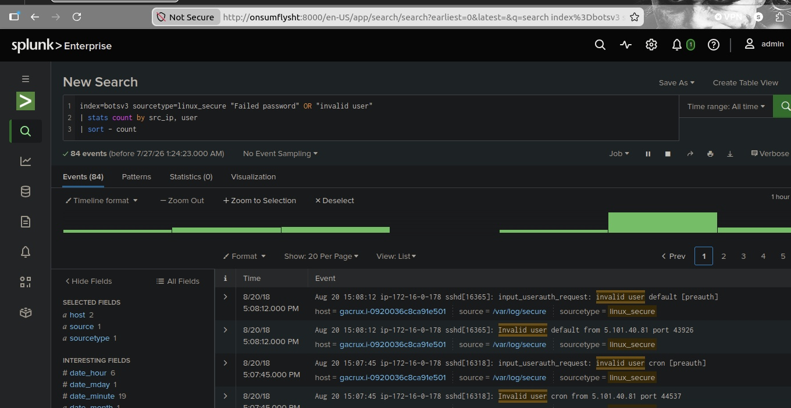
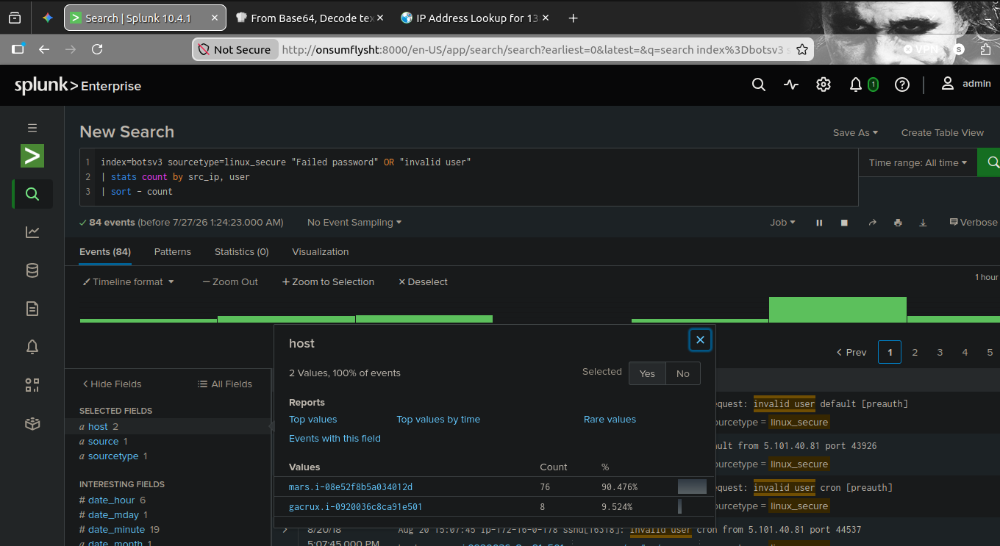
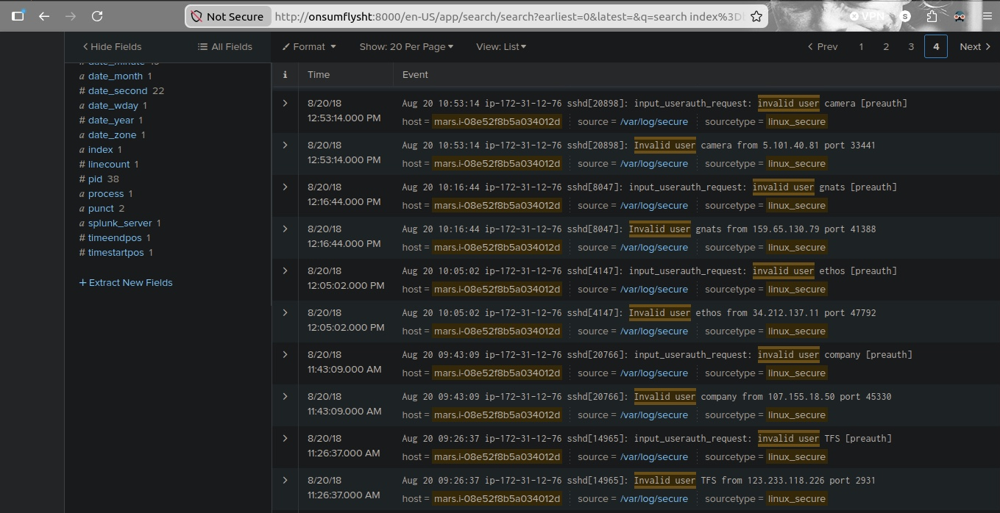
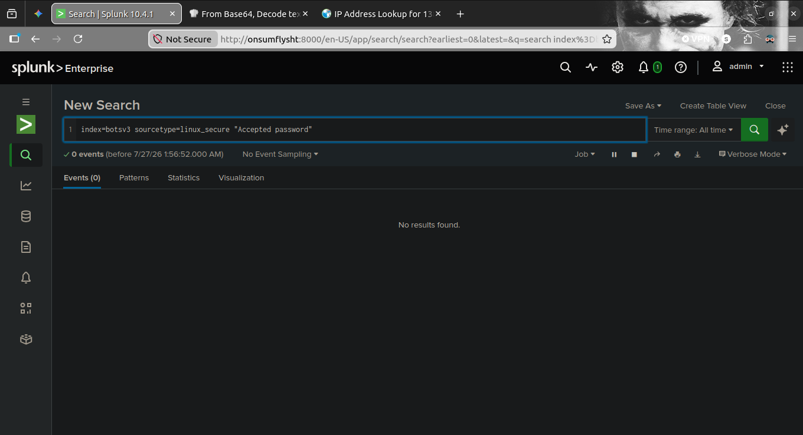
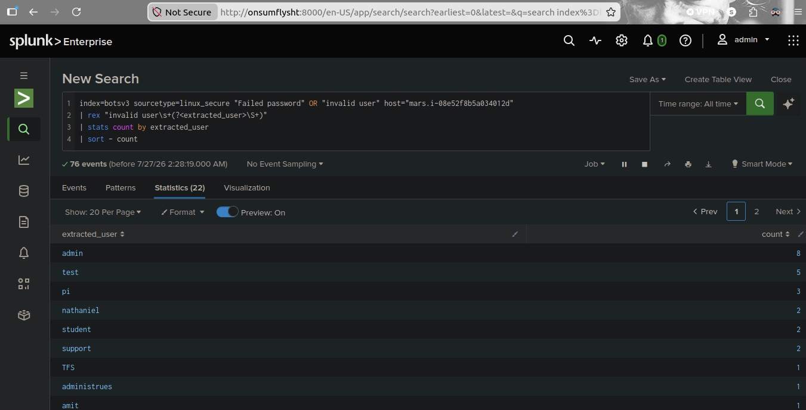
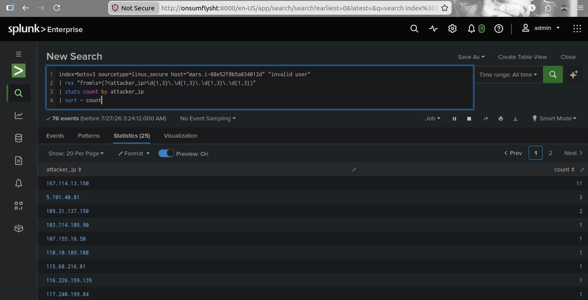

<h1>🛡️ Scenario 2: Linux SSH Brute Force & Account Enumeration Analysis</h1>

<h2>📌 Incident Overview</h2>

During security operations monitoring, an anomalous volume of authentication failures on Linux infrastructure was detected. Threat hunting operations using Splunk Enterprise across the <code>index=botsv3</code> dataset identified an active SSH brute-force and account enumeration campaign directed at host <code>mars.i-08e52f8b5a034012d</code>. Attackers systematically attempted to gain unauthorized access using common default and administrative accounts (e.g., <code>admin</code>, <code>test</code>, <code>pi</code>, <code>support</code>).

<h2>🎯 MITRE ATT&CK Mapping</h2>
<ul>
  <li><strong>Tactic:</strong> Credential Access (<a href="https://attack.mitre.org/tactics/TA0006/">TA0006</a>)</li>
  <li><strong>Technique:</strong> Brute Force: Password Guessing (<a href="https://attack.mitre.org/techniques/T1110/001/">T1110.001</a>)</li>
  <li><strong>Technique:</strong> Account Discovery (<a href="https://attack.mitre.org/techniques/T1087/">T1087</a>)</li>
</ul>

<h2>📋 Key Investigation Findings</h2>
<ul>
  <li><strong>Target Server Identified:</strong> <code>mars.i-08e52f8b5a034012d</code> (absorbed 76/84 total failure events ~ 90.5%)</li>
  <li><strong>Attack Vector:</strong> SSH Authentication Protocol (<code>sshd</code> daemon)</li>
  <li><strong>Top Target Accounts:</strong> <code>admin</code> (8), <code>test</code> (5), <code>pi</code> (3), <code>nathaniel</code> (2), <code>student</code> (2), <code>support</code> (2)</li>
  <li><strong>Primary Attacker Source IPs:</strong>
    <ul>
      <li><code>167.114.13[.]150</code> (11 attempts)</li>
      <li><code>5.101.40[.]81</code> (3 attempts)</li>
      <li><code>109.31.137[.]150</code> (2 attempts)</li>
    </ul>
  </li>
  <li><strong>System Compromise Status:</strong> <strong>Negative (0 Compromise)</strong> — Verification queries confirmed 0 successful SSH logins occurred during this activity.</li>
</ul>

<h2>🔍 Investigation Walkthrough</h2>

<h3>Phase 1: Environment-Wide Authentication Failure Baseline</h3>

An initial broad hunt was conducted across Linux authentication logs (<code>sourcetype=linux_secure</code>) to measure failed logins and unparsed account attempts.

<pre><code>index=botsv3 sourcetype=linux_secure "Failed password" OR "invalid user"
| stats count by src_ip, user
| sort - count</code></pre>

<em>Figure 1: Initial SPL query identifying raw failed password and invalid user SSH authentication logs.</em>

<h3>Phase 2: Target Isolation & Scope Breakdown</h3>

Evaluating the <code>host</code> field distribution across the 84 returned events isolated host <code>mars.i-08e52f8b5a034012d</code> as the primary target.

<em>Figure 2: Host distribution showing host 'mars' absorbing over 90% of all authentication attack volume.</em>

<h3>Phase 3: Raw Event & Timestamp Log Analysis</h3>

Reviewing raw syslog records from <code>/var/log/secure</code> on <code>mars</code> confirmed continuous incoming connection attempts targeting different non-existent users from multiple external addresses.

<em>Figure 3: Forensic log entries displaying SSH daemon ('sshd') pre-authentication invalid user requests across timestamps.</em>

<h3>Phase 4: Compromise Verification (Accepted Passwords)</h3>

To verify if any brute-force attempt successfully guessed a valid password, a query targeting accepted authentication events was executed.

<pre><code>index=botsv3 sourcetype=linux_secure "Accepted password"</code></pre>

<em>Figure 4: Splunk search returning zero results, proving no unauthorized SSH session was successfully established.</em>

<h3>Phase 5: Parsing Targeted Accounts via Regular Expressions (<code>rex</code>)</h3>

Because raw syslog messages embed target usernames in text strings, SPL regular expressions (<code>rex</code>) were used to extract and count targeted accounts.

<pre><code>index=botsv3 sourcetype=linux_secure "Failed password" OR "invalid user" host="mars.i-08e52f8b5a034012d"
| rex "invalid user\s+(?&lt;extracted_user&gt;\S+)"
| stats count by extracted_user
| sort - count</code></pre>

<em>Figure 5: Extracted usernames ranking 'admin', 'test', and 'pi' as the most frequently targeted credentials.</em>

<h3>Phase 6: Isolating Attacker Source IP Addresses</h3>

Custom Regular Expression parsing was applied to isolate external IPv4 addresses generating brute-force activity against the target server.

<pre><code>index=botsv3 sourcetype=linux_secure host="mars.i-08e52f8b5a034012d" "invalid user"
| rex "from\s+(?&lt;attacker_ip&gt;\d{1,3}\.\d{1,3}\.\d{1,3}\.\d{1,3})"
| stats count by attacker_ip
| sort - count</code></pre>

<em>Figure 6: Source IP aggregation identifying top attacking endpoints including 167.114.13[.]150 and 5.101.40[.]81.</em>

<h2>🚨 Indicators of Compromise (IoCs)</h2>

<em>Note: All IP addresses are defanged in compliance with SOC security reporting standard practices.</em>

<ul>
  <li><strong>Target System:</strong> <code>mars.i-08e52f8b5a034012d</code></li>
  <li><strong>Primary Attacking IPv4:</strong> <code>167.114.13[.]150</code> (11 events)</li>
  <li><strong>Secondary Attacking IPv4:</strong> <code>5.101.40[.]81</code> (3 events)</li>
  <li><strong>Additional Attacking IPv4s:</strong> <code>109.31.137[.]150</code>, <code>103.114.105[.]90</code>, <code>107.155.18[.]50</code></li>
</ul>

<h2>🛡️ Response & Mitigation Recommendations</h2>
<ol>
  <li><strong>Enforce Public-Key Authentication Only:</strong> Disable password-based SSH logins by setting <code>PasswordAuthentication no</code> in <code>/etc/ssh/sshd_config</code>.</li>
  <li><strong>Implement Fail2Ban / Automated Blocking:</strong> Deploy automated log parsing tools like <code>fail2ban</code> to automatically block IP addresses exceeding 5 failed login attempts via host firewalls.</li>
  <li><strong>Restrict Port 22 Access:</strong> Restrict public inbound SSH access using AWS Security Groups or network firewalls to allowed VPN endpoints or bastion hosts only.</li>
  <li><strong>Enforce PAM Lockout Rules:</strong> Implement Pluggable Authentication Modules (PAM) lockout parameters to temporarily disable accounts after multiple consecutive failed login attempts.</li>
</ol>
